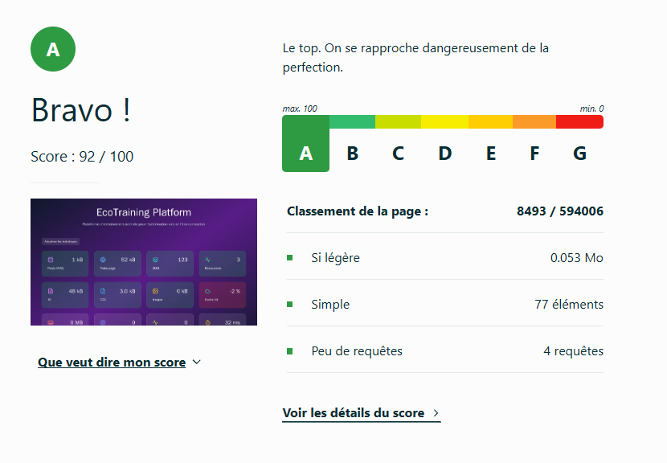

# Audit final

## 1. Audit Lighthouse


Amélioration importante des performances


### Performances


## 2. Audit greenIt

| Date                | URL                   | Nombre de requêtes | Taille de la page (Ko) | Taille du DOM | GES (gCO2e) | Eau (cl) | EcoIndex | Note |
|---------------------|-----------------------|--------------------|------------------------|---------------|-------------|----------|----------|------|
| 10/06/2026 16:24:57 | https://indoor-contacted-injection-mit.trycloudflare.com/ | 5 | 1  | 77  | 1.15  | 1.73 | 92.28 | A |


## 3. Ecoindex.fr




---

## US traitées :

### Optimisation réalisées

| Optimisation réalisée                                   | US concernées            |
| ------------------------------------------------------- | ------------------------ |
| Conversion de l'image principale en WebP                | US 1, US 2, US 11        |
| Suppression des animations inutiles                     | US 12, US 6, US 11       |
| Suppression de la visualisation 3D                      | US 12, US 6, US 8, US 11 |
| Suppression du polling réseau                           | US 4, US 6, US 10, US 11 |
| Suppression des recalculs automatiques des statistiques | US 6, US 11              |
| Suppression du PerformanceObserver                      | US 6, US 11              |
| Simplification des appels API                           | US 4, US 10, US 11       |
| Correction de la mesure du DOM                          | US 11                    |
| Suppression du state `ready` bloquant le rendu          | US 1, US 6               |
| Suppression de `big.css` et `big.js`                    | US 4, US 5, US 6, US 8   |
| Suppression des polices inutiles                        | US 1, US 4, US 11        |
| Suppression des dépendances inutilisées                 | US 6, US 8, US 11        |
| Mise en cache navigateur                                | US 9, US 11              |
| Utilisation du build de production pour les audits      | US 1, US 8, US 11        |

---


### US 2 – Réduction du poids des images

**Réalisations**

* conversion JPEG → WebP ;
* compression des ressources ;
* réduction massive du poids des images.

**Résultat**

```text
6,8 Mo → 36 Ko
```

---

### US 4 – Réduction du nombre de requêtes réseau

**Réalisations**

* suppression du polling ;
* suppression des chargements CSS/JS inutiles ;
* simplification des appels API.

**Résultat**

Réduction importante du nombre de requêtes réalisées au chargement.

---

### US 5 – Compression et optimisation des ressources statiques

**Réalisations**

* suppression des ressources inutiles (`big.css`, `big.js`) ;
* maintien de la compression Express ;
* réduction du poids transféré.

---

### US 6 – Réduction du JavaScript exécuté

**Réalisations**

* suppression des dépendances inutilisées ;
* suppression des `useEffect` inutiles ;
* suppression du polling ;
* suppression du `PerformanceObserver` ;
* suppression des animations inutiles.

**Résultat**

```text
Total Blocking Time : 0 ms
```

---

### US 8 – Réduction du poids du bundle React

**Réalisations**

* suppression de bibliothèques inutilisées ;
* suppression de la scène 3D ;
* suppression de code mort.

**Résultat**

```text
Bundle JS : 153 Ko
CSS : 12 Ko
```

Objectif atteint (< 300 Ko).

---

### US 9 – Mise en cache des ressources

**Réalisations**

* activation du cache navigateur sur les ressources statiques ;
* préparation des ressources à une réutilisation lors des visites suivantes.

---

### US 10 – Optimisation des appels API

**Réalisations**

* suppression du endpoint `/api/payload` ;
* suppression du polling ;
* récupération des seules données réellement utilisées.

---

### US 11 – Amélioration de l'EcoIndex

L'ensemble des optimisations précédentes contribue directement à l'amélioration de l'EcoIndex :

* moins de données transférées ;
* moins de requêtes ;
* moins de JavaScript exécuté ;
* moins de ressources chargées ;
* meilleure utilisation du cache.

---

### US 12 – Sobriété visuelle

**Réalisations**

* suppression des animations décoratives ;
* suppression de la visualisation 3D ;
* simplification de l'interface.

**Bénéfices**

* réduction de la charge CPU/GPU ;
* amélioration du confort visuel ;
* réduction du coût environnemental du rendu.
