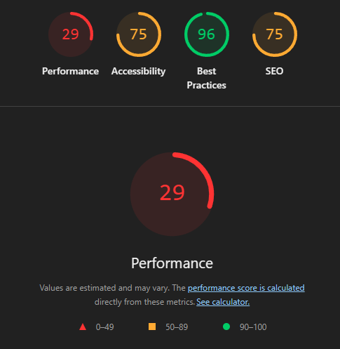
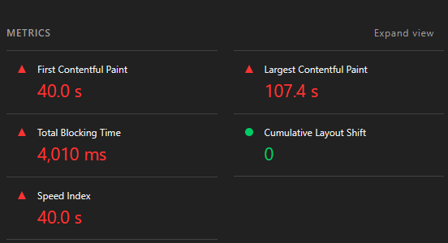
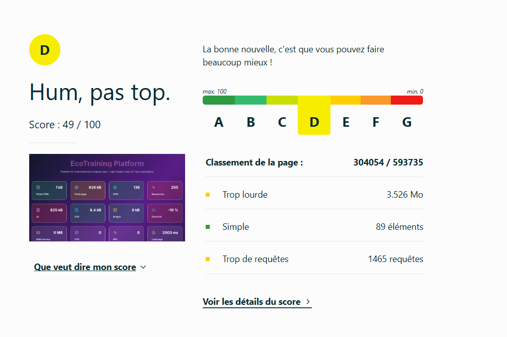
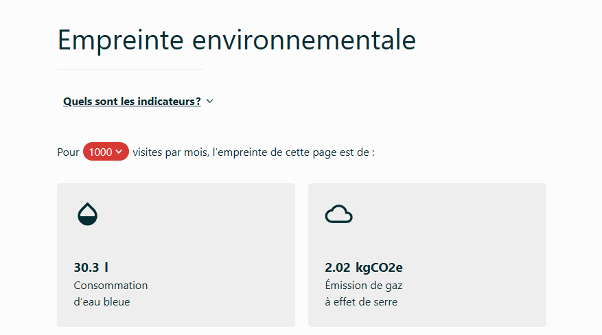
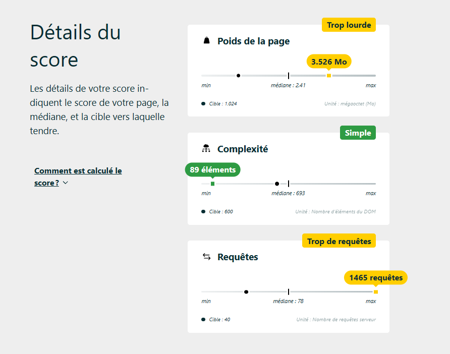

# Audit initial du projet

## 1. Audit Lighthouse

l'audit lighthouse met en lumière d'importants et nombreux problèmes de performances de l'application
on repère également des axes de progrès concernant l'accessibilité et le SEO.

### Performances

Le premier contenu de la page s'affiche au bout d'environ 40 secondes ce qui est beaucoup trop important. 
Le contenu principal de la page (LCP) s'affiche quand à lui au out de 107s.
des études montres qu'une majorité des utilisateurs du web quittent un site web à partir de 3 secondes d'attente.

En conséquence le score SpeedIndex est de zero

Total blocking time (TBT) = 4010ms.  la page est donc bloquée et ne peut répondre aux entrées utilisateurs durant environ 1,5 secondes au total.
Cet indicateur indique un cumul important de blocking time et donc des taches trop longues (+ de 50ms)

Actions de résolution possibles : excecution javascript inutile.

## 2. Audit greenIt

| Date                | URL                   | Nombre de requêtes | Taille de la page (Ko) | Taille du DOM | GES (gCO2e) | Eau (cl) | EcoIndex | Note |
|---------------------|-----------------------|--------------------|------------------------|---------------|-------------|----------|----------|------|
| 10/06/2026 10:31:29 | http://localhost:3000/ | 1496 | 27  | 140  | 1.80  | 2.70 | 59.86 | C |

## 3. Ecoindex.fr

### Page trop lourde et trop de requetes 
Poids de la page : 3.526 Mo
Nb de requetes : 1465 requêtes

**Page trop lourde**
- Optimisez les images en choisissant le bon format et réduisant la taille
- Évitez les vidéos et fonds vidéos
- Compresser les fichiers (HTML, CSS, JS, SVG)
- Remplacez autant que possible les images d’interface par des styles CSS et des pictos
- Facilitez la mise en cache navigateur

**Trop de requetes**
- Limitez l’utilisation de widgets et plugins
- Utilisez des polices standards plutôt que des polices custom
- Regroupez les images dans un sprite
- Regroupez certaines feuilles de styles (CSS) et bibliothèques Javascript (JS).
- Préférez les pages statiques